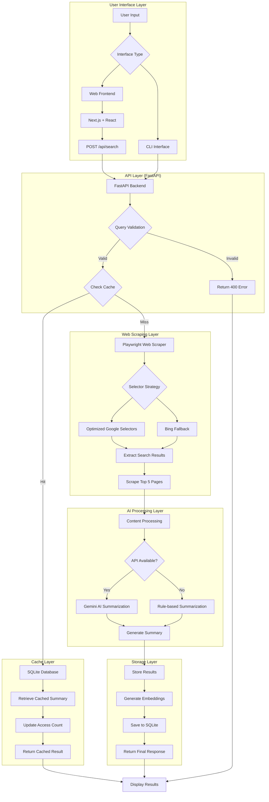
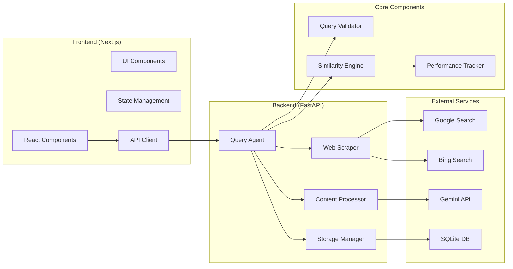

# Web Browser Query Agent

An intelligent web search agent that validates queries, searches the web, and provides summarized results with smart caching and similarity matching.

## 🎥 Demo Video
[Watch the full demonstration and architecture explanation](https://drive.google.com/file/d/1VOwim0PejfpHqcj9yoKSSpjgEpkvG8Hl/view?usp=sharing)

## 🚀 Features

### Core Functionality
- **Query Validation**: Intelligently distinguishes between valid search queries and commands
- **Similarity Matching**: Detects similar queries to return cached results
- **Web Scraping**: Uses Playwright with optimized Google selectors and Bing fallback
- **AI Summarization**: Leverages Gemini API for intelligent content summarization
- **Smart Caching**: SQLite-based storage with semantic similarity matching
- **Performance Tracking**: Monitors selector performance and optimizes scraping strategy

### User Interfaces
- **CLI Mode**: Interactive command-line interface for terminal users
- **Web Interface**: Modern React/Next.js frontend with real-time statistics
- **REST API**: FastAPI backend with comprehensive endpoints

### Advanced Features
- **Multi-Engine Search**: Google primary with Bing fallback
- **Selector Optimization**: Dynamic selector performance tracking and optimization
- **Response Time Tracking**: Detailed performance metrics
- **Cache Hit Analytics**: Smart caching with access count tracking
- **Error Handling**: Robust error handling with fallback mechanisms

## 🏗️ Architecture

### System Flow Diagram



### Component Architecture



## 🛠️ Tech Stack

### Backend
- **FastAPI**: High-performance Python web framework
- **Playwright**: Web scraping and browser automation
- **SQLite**: Local database for caching
- **Google Gemini**: AI-powered summarization
- **Sentence Transformers**: Semantic similarity matching
- **BeautifulSoup**: HTML parsing and content extraction
- **NumPy & Scikit-learn**: Numerical computations and similarity metrics

### Frontend
- **Next.js 14**: React framework with App Router
- **TypeScript**: Type-safe JavaScript
- **Tailwind CSS**: Utility-first CSS framework
- **Shadcn/UI**: Modern UI component library
- **Lucide React**: Icon library

### CLI
- **Click**: Python CLI framework
- **Rich formatting**: Enhanced terminal output

## 📁 Project Structure

```
web-browser-agent/
├── backend/
│   ├── fastapi_backend.py      # FastAPI server with REST endpoints
│   ├── query_agent.py          # Core agent logic + CLI interface
│   ├── query_agent.db          # SQLite database (auto-generated)
│   ├── requirements.txt        # Python dependencies
│   ├── .env                    # Environment variables
│   └── debug_page.html         # Debug utilities
├── frontend/
│   ├── app/
│   │   ├── page.tsx            # Main application page
│   │   ├── layout.tsx          # App layout
│   │   └── globals.css         # Global styles
│   ├── components/
│   │   └── ui/                 # Shadcn UI components
│   ├── lib/
│   │   └── utils.ts            # Utility functions
│   ├── package.json            # Node.js dependencies
│   └── next.config.ts          # Next.js configuration
└── README.md                   # This file
```

## 🚦 Getting Started

### Prerequisites
- Python 3.8+
- Node.js 18+
- npm or yarn

### Backend Setup

1. **Clone and navigate to backend**:
```bash
cd backend
```

2. **Create virtual environment**:
```bash
python -m venv venv
source venv/bin/activate  # On Windows: venv\Scripts\activate
```

3. **Install dependencies**:
```bash
pip install -r requirements.txt
```

4. **Set up environment variables** (create `.env` file):
```env
GOOGLE_API_KEY=your_gemini_api_key_here
HOST=0.0.0.0
PORT=8000
DEBUG=false
```

5. **Install Playwright browsers**:
```bash
playwright install chromium
```

### Frontend Setup

1. **Navigate to frontend**:
```bash
cd frontend
```

2. **Install dependencies**:
```bash
npm install
```

3. **Start development server**:
```bash
npm run dev
```

## 🎯 Usage

### CLI Mode (Interactive)
```bash
cd backend
python query_agent.py interactive
```

Example session:
```
🔍 Web Browser Query Agent
Enter your queries (type 'quit' to exit)
--------------------------------------------------

> Best restaurants in Mumbai
Processing...
==================================================
Based on 5 sources, here's what I found about 'Best restaurants in Mumbai':

**1. Top 10 Best Restaurants in Mumbai - 2024**
Mumbai offers an incredible dining scene with options ranging from street food to fine dining...
🔗 Source: https://example.com/mumbai-restaurants
==================================================
```

### CLI Mode (Single Query)
```bash
python query_agent.py search "Latest AI technology trends 2024"
```

### CLI Statistics
```bash
python query_agent.py stats
```

### Web Interface
1. Start the backend server:
```bash
cd backend
python fastapi_backend.py
```

2. Start the frontend:
```bash
cd frontend
npm run dev
```

3. Open http://localhost:3000 in your browser

### REST API
Start the FastAPI server and visit http://localhost:8000/docs for interactive API documentation.

Key endpoints:
- `POST /api/search` - Main search endpoint
- `POST /api/validate` - Query validation
- `GET /api/stats` - Query statistics
- `GET /api/selectors/performance` - Selector performance metrics

## 🎛️ Configuration

### Environment Variables
- `GOOGLE_API_KEY`: Gemini API key for AI summarization
- `HOST`: Server host (default: 0.0.0.0)
- `PORT`: Server port (default: 8000)
- `DEBUG`: Enable debug mode (default: false)

### Query Validation
The system validates queries using multiple criteria:
- **Invalid patterns**: Commands like "walk my pet", "add apples"
- **Search intent**: Looks for question words (what, how, best, etc.)
- **Length validation**: Ensures reasonable query length

### Similarity Matching
- Uses sentence-transformers model: `all-MiniLM-L6-v2`
- Similarity threshold: 0.75 (configurable)
- Cosine similarity for matching queries

## 🔧 API Endpoints

### Core Endpoints
| Method | Endpoint | Description |
|--------|----------|-------------|
| GET | `/` | Health check and service info |
| POST | `/api/search` | Main search functionality |
| POST | `/api/validate` | Validate query |
| GET | `/api/stats` | Get query statistics |
| GET | `/api/health` | Detailed health check |

### Advanced Endpoints
| Method | Endpoint | Description |
|--------|----------|-------------|
| GET | `/api/selectors/performance` | Selector performance metrics |
| POST | `/api/selectors/reset` | Reset performance tracking |
| GET | `/api/similar/{query}` | Find similar queries |
| DELETE | `/api/cache` | Clear query cache |
| GET | `/api/debug/last-search` | Debug last search |

## 🎨 Features Deep Dive

### Smart Selector Optimization
The system tracks performance of different CSS selectors for Google search results:
- Success rate monitoring
- Average results per selector
- Dynamic selector ordering based on performance
- Fallback chain for reliability

### Intelligent Caching
- **Semantic similarity**: Uses embeddings to find similar queries
- **Access tracking**: Monitors cache hit patterns
- **Storage efficiency**: Compressed embeddings in SQLite
- **Cache invalidation**: Manual cache clearing available

### Multi-Engine Strategy
1. **Primary**: Google with optimized selectors
2. **Fallback**: Bing search if Google fails
3. **Requests fallback**: Simple HTTP requests if Playwright fails

### AI-Powered Summarization
- **Gemini Integration**: Uses Google's Gemini API when available
- **Fallback Logic**: Rule-based summarization without API
- **Content Processing**: Intelligent extraction of key information
- **Source Attribution**: Maintains links to original sources

## 📊 Performance Metrics

### Response Time Tracking
- Average response time calculation
- Cache vs new search timing
- Selector performance impact

### Cache Efficiency
- Hit rate monitoring
- Query similarity scoring
- Storage utilization

### Scraping Success Rate
- Selector success tracking
- Engine fallback statistics
- Content extraction quality

## 🐛 Troubleshooting

### Common Issues

1. **Google Blocking**: 
   - Uses rotating User-Agents
   - Implements delays and stealth mode
   - Falls back to Bing automatically

2. **API Rate Limits**:
   - Implements exponential backoff
   - Falls back to rule-based summarization

3. **Database Locks**:
   - Proper connection handling
   - Transaction management

### Debug Mode
Enable debug logging by setting `DEBUG=true` in environment variables.

## 🔮 Future Enhancements

### Planned Features
- [ ] Multi-language support
- [ ] Custom search engine configuration
- [ ] Advanced filtering options
- [ ] Export functionality
- [ ] Real-time collaboration
- [ ] Mobile app interface

### Technical Improvements
- [ ] Redis caching for better performance
- [ ] Kubernetes deployment
- [ ] Advanced NLP for query understanding
- [ ] Machine learning for result ranking

## 🤝 Contributing

1. Fork the repository
2. Create a feature branch
3. Make your changes
4. Add tests if applicable
5. Submit a pull request

## 📄 License

This project is licensed under the MIT License - see the LICENSE file for details.

## 🙏 Acknowledgments

- **Google Gemini**: AI summarization capabilities
- **Playwright Team**: Robust web scraping framework
- **Sentence Transformers**: Semantic similarity matching
- **FastAPI**: High-performance web framework
- **Next.js Team**: Modern React framework

---

**Built with ❤️ for intelligent web search**
